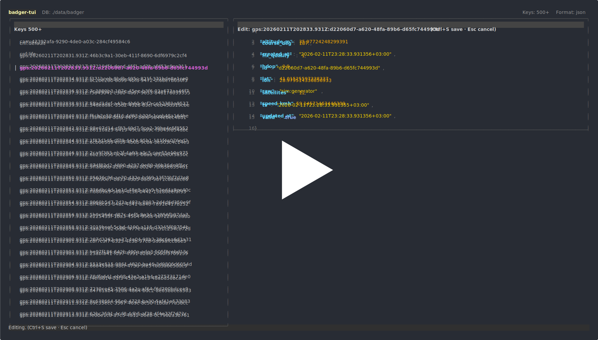

# badger-gui

A fast, minimal, keyboard-driven terminal UI for safely inspecting and
managing BadgerDB databases.

## Demo

## Overview

**badger-gui** is a cross-platform CLI GUI built for developers who work directly with embedded BadgerDB databases.

It provides a focused, keyboard-driven interface for exploring, inspecting, and safely modifying key-value data — without writing temporary scripts or ad-hoc tooling.

Designed to stay out of your way, badger-gui is intentionally lightweight and runs directly against your existing Badger database.

Built in Go, it runs natively on:

- Linux
- macOS
- Windows

No external services.  
No background daemons.  
No database server required.

It operates directly on the embedded Badger database, acting purely as an interactive inspection and controlled mutation layer.

badger-gui is built for engineers who want to stay close to their data during development, debugging, and incident analysis.

## Built for BadgerDB

This tool uses **BadgerDB**, a high-performance embedded key-value
database written in Go.

Repository:\
https://github.com/dgraph-io/badger

Badger provides:

-   LSM-based architecture
-   Efficient key iteration
-   High write throughput
-   Value log separation
-   Fully embeddable design

badger-gui acts purely as an inspection and controlled mutation layer.

## Philosophy

-   Minimal surface area
-   Fast startup & low memory footprint
-   Keyboard-first interaction
-   Safe by default
-   No hidden background jobs
-   Designed for large datasets

This tool does not replace application-level logic.\
It provides a controlled inspection layer for developers.

## Architecture

badger-gui follows a minimal layered architecture with explicit
responsibility boundaries.

### High-Level Flow

    Terminal (User Input)
            ↓
    TUI Layer (State + Rendering)
            ↓
    Command Dispatcher
            ↓
    Badger Transaction Layer
            ↓
    BadgerDB Storage Engine

### Layers

#### TUI Layer

-   State-driven rendering
-   Cursor and mode management
-   Keyboard event handling
-   No direct database mutations

#### Command Layer

-   Converts UI intent into database operations
-   Validates destructive actions
-   Ensures explicit confirmation
-   Returns structured results to the UI

#### Transaction Layer

-   Read → View transactions
-   Write/Delete → Update transactions
-   Iteration → Badger iterators

#### Lazy Value Loading

-   Keys iterated independently
-   Values loaded only when selected
-   No eager loading of large value sets

#### Concurrency Model

-   Single-threaded UI event loop
-   No background goroutines mutating state
-   Serialized database access through transactions

## Features

-   Key list with real-time search / filter
-   Lazy value loading
-   Multi-format viewer:
    -   text
    -   hex
    -   base64
    -   json (auto-detected + formatted)
-   Inline edit & save (Ctrl+S)
-   Delete single key
-   Delete by pattern
-   Group counts by prefix
-   About dialog (F1)

## Installation

### Requirements

Go 1.25+

### Build from source

    go build -o badger-gui .

## Usage

    ./badger-gui --dbpath ./data/badger

Short flag:

    ./badger-gui -d ./data/badger

## Keybindings

| Key             | Action                                  |
|-----------------|------------------------------------------|
| ↑ / ↓           | Navigate key list                       |
| Enter           | Load value & focus right panel          |
| Esc / Shift+←   | Return to key list                      |
| /               | Filter keys                             |
| t               | Text view                               |
| h               | Hex view                                |
| b               | Base64 view                             |
| j               | JSON view                               |
| e               | Edit value                              |
| Ctrl+S          | Save edited value                       |
| d / Delete      | Delete selected key                     |
| p               | Delete by pattern                       |
| g               | Group counts by prefix                  |
| F1              | About                                   |
| q               | Quit                                    |

## Performance Characteristics

-   Efficient iteration using Badger iterators
-   Lazy value loading
-   Minimal allocations during navigation
-   Handles large datasets
-   No preloading of values

Performance largely depends on disk I/O.

## Safety Notes

-   All mutations use official Badger transactions
-   No direct value log access
-   Pattern deletes require explicit confirmation
-   Editing respects selected format
-   No background tasks

## Troubleshooting

### UI does not render correctly

Check terminal type:

    echo $TERM

Recommended values:

-   xterm-256color
-   tmux-256color
-   screen-256color

If necessary:

    export TERM=xterm-256color

### Colors look incorrect or limited

Verify color support:

    tput colors

The output should be `256`.

### Running inside tmux

Add to `.tmux.conf`:

    set -g default-terminal "tmux-256color"
    set -ga terminal-overrides ",xterm-256color:Tc"

Restart tmux:

    tmux kill-server

### Running over SSH

Try connecting with:

    ssh -t user@host

### Database lock error

If you see:

    Cannot acquire directory lock

Another process is using the database.

Stop the running application before launching badger-gui.

### JSON formatting fails

Ensure the stored value is valid JSON.\
Switch to `text` or `hex` view to inspect raw content.

### Performance issues on large databases

-   Prefer local SSD storage
-   Avoid network-mounted volumes
-   Ensure no other heavy I/O workloads are running

## Roadmap

-   Advanced prefix filtering
-   Export / Import functionality
-   Statistics view
-   Read-only enforcement mode
-   Compaction visibility
-   Plugin support

## Contributing

Issues, feedback, and improvements are welcome.

## License

Apache License 2.0
